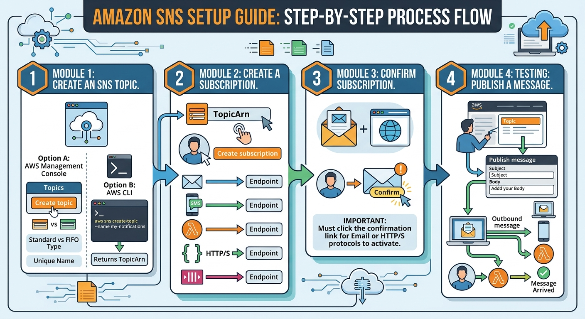
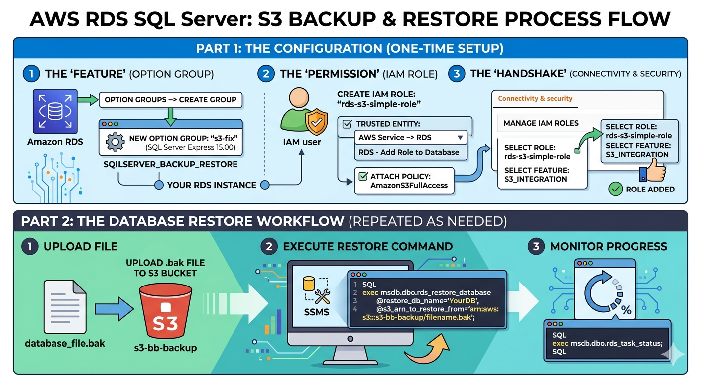
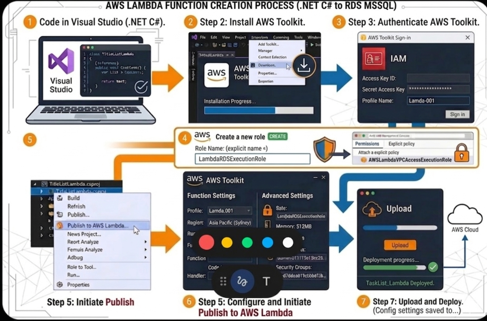
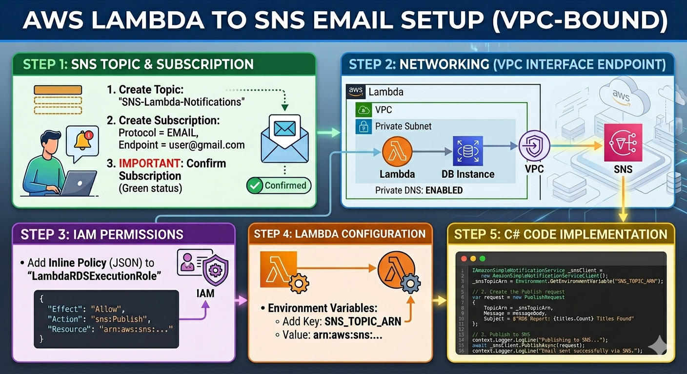
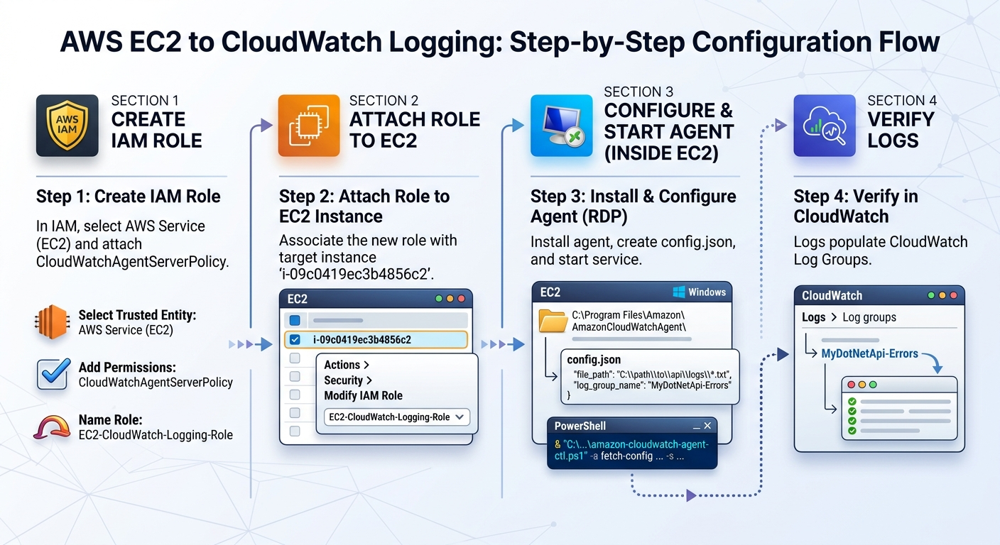
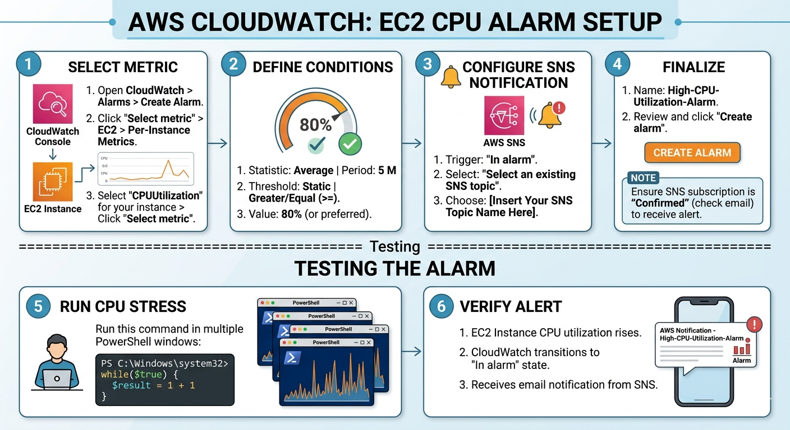
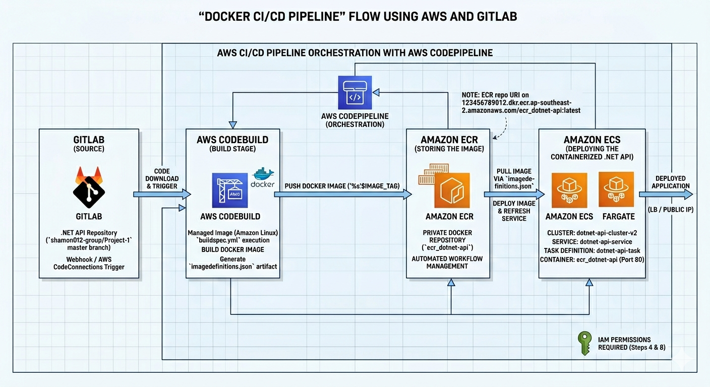

# AWS Cloud Architecture & Process Blueprints

This repository provides a collection of architectural blueprints and step-by-step process flows for AWS cloud services. It demonstrates advanced implementation patterns for serverless compute, event-driven messaging, relational databases, and automated CI/CD pipelines.

---

## 🏗️ Architectural Workflows

### 1. Amazon SNS Setup Guide
The Amazon SNS setup guide outlines an end-to-end configuration process for cloud messaging. It begins with topic creation via the AWS Management Console or CLI to establish a unique communication channel. Next, subscriptions are managed by connecting that topic to various protocols like Email, Lambda, or HTTP/S. A mandatory confirmation step follows to activate the connection, concluding with a testing phase where a message is published to verify successful delivery to all endpoints.

**Process Flow:**

---

### 2. AWS RDS SQL Server: S3 Backup & Restore
A technical operational workflow detailing the one-time configuration of IAM roles and option groups, followed by the specific SQL commands required to execute and monitor database restores from an Amazon S3 bucket.

**Process Flow:**

---

### 3. AWS Lambda Function Creation (.NET C#)
A step-by-step developer guide for deploying .NET C# applications from Visual Studio to AWS Lambda. This covers the installation of the AWS Toolkit, IAM role execution policies, and the final deployment verification process.

**Process Flow:**

---

### 4. AWS Lambda to SNS Email Setup (VPC-Bound)
A specialized networking blueprint for triggering email notifications via SNS from a Lambda function residing within a private VPC. It includes configurations for VPC Interface Endpoints, IAM inline policies, and C# code implementation.

**Process Flow:**

---

### 5. EC2 to CloudWatch Logging Workflow
A step-by-step configuration flow for centralized logging. This diagram outlines the process of creating IAM roles, installing the CloudWatch Agent via RDP on Windows instances, and verifying log population within CloudWatch Log Groups.

**Process Flow:**

---

### 6. CloudWatch EC2 CPU Alarm Setup
An observability blueprint for proactive infrastructure monitoring. It details the process of defining metric conditions, configuring SNS notification triggers, and performing CPU stress testing to verify alarm functionality.

**Process Flow:**

---

### 7. Docker CI/CD Pipeline: GitLab, Amazon ECR, and ECS Orchestration
An advanced orchestration blueprint for containerized .NET APIs. This flow demonstrates the integration of GitLab source control with AWS CodeBuild, Amazon ECR for image storage, and Amazon ECS Fargate for automated application deployment.

**Process Flow:**

---

### 8. AWS CI/CD Pipeline: GitLab Integration with CodeDeploy & IIS
A multi-stage deployment strategy for .NET 8 APIs onto Windows Server environments. It highlights the coordination between S3 artifacts, GitLab connections, and the AWS CodeDeploy agent for in-place application updates.

**Process Flow:**

---

## 🛠️ Tech Stack Featured
*   **Development:** .NET 8 / C#, Visual Studio, PowerShell.
*   **Cloud Infrastructure:** AWS (Lambda, SNS, RDS, EC2, S3, CloudWatch).
*   **DevOps & Containers:** Docker, GitLab, Amazon ECR/ECS, AWS CodePipeline.
*   **Networking:** VPC Endpoints, IAM Policy Management.
